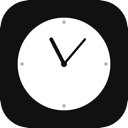

<p align="center">
  
</p>

<h1 align="center">RemindMe</h1>

<p align="center">
  <strong>A minimalist, natural language-powered reminder app for macOS</strong>
</p>

<p align="center">
  <a href="https://github.com/samirpatil2000/remindme/releases/latest">
    
  </a>
  
  
  <a href="https://deepwiki.com/samirpatil2000/remindme"></a>
</p>

---

### ✨ Why RemindMe?
- **Ultra-lightweight** — Built with SwiftUI for modern macOS performance, minimal RAM/CPU usage.
- **Natural Language Parsing** — Set reminders with ease using tokens like `@1m`, `@10m`, `@1h`.
- **Dual Input Modes** — Type your time to get smart suggestions, or select custom durations directly from an elegant visual TimePicker UI.
- **Focus Analytics** — Track your productivity with aggregate focus time and snooze counts natively in the Status Board.
- **Global Hotkey** — Use a customizable global shortcut to instantly bring up the command window from anywhere.
- **Todoist-inspired Design** — Clean, functional interface, beautiful hover-reveal UI for completed tasks, and elegant popovers.
- **Auto Launch** — Enable launch at login so your reminder system is always ready when you are.
- **Privacy First** — Everything stays on your Mac, no cloud syncing, no data tracking.
- **Native Experience** — Deeply integrated with macOS notifications and menu bar tools.

---

### 📥 Download

<p align="center">
  <a href="https://github.com/samirpatil2000/remindme/releases/download/v1.0/RemindMe_Release.dmg">
    
  </a>
</p>

1. Download the `.dmg` from the latest release.
2. Drag **RemindMe.app** to your **Applications** folder.
3. Launch it (lives in your menu bar).
4. **Note (not yet notarized)**: Right-click → Open → confirm in security dialog.

---

## 🚀 Getting Started

1. **Launch** RemindMe — it will appear in your menu bar with a clock icon.
2. **Press ⌘⇧Space** from any app to open the Command Window.
3. **Type your reminder** (e.g., `Call Mom @10m` or `Check the oven @5m`).
4. **Press Enter** to set the reminder.
5. **Receive a native notification** when the timer expires!

---

## ⌨️ Keyboard Shortcuts

| Shortcut | Action |
|----------|--------|
| `⌘⇧Space` | Open command window |
| `↵` Enter | Save reminder |
| `⎋` Esc | Close command window |
| `⌘ ,` | Open Settings |

---

## Screenshots 

1. Quick Reminder Entry with Smart Time Suggestion


2. Natural Language Input with @ Time Tokens


3. Visual TimePicker for Custom Durations


4. Status Board: All Clear & Focus Summary


5. Actionable Reminder Notification with Snooze Options


## 🛠️ Building from Source

```bash
# Clone the repository
git clone https://github.com/samirpatil2000/remindme.git
cd remindme

# Open in Xcode
open Package.swift

# Build and run
# Press ⌘R in Xcode
```

### Requirements
- macOS 15.0 or later
- Xcode 16.0 or later
- Swift 6.0

---

## 📁 Project Structure

```
RemindMe/
├── App/
│   ├── AppDelegate.swift       # App lifecycle & Carbon hotkey setup
│   └── RemindMeApp.swift       # Swift entry point
├── Managers/
│   ├── HotkeyManager.swift     # Global keyboard shortcuts (Carbon API)
│   ├── NotificationManager.swift # macOS notification delivery
│   └── PermissionsManager.swift # Notification permissions handler
├── Parser/
│   ├── ReminderParser.swift    # Natural language parsing logic
│   └── TimeToken.swift         # Duration token definitions (@1m, etc.)
├── Models/
│   └── Reminder.swift         # Core data structure
└── Views/
    ├── CommandWindow.swift     # Quick entry UI
    ├── MenuBarView.swift       # Menu bar item controller
    └── SettingsView.swift      # App preferences
```

---

## 🤝 Contributing

Contributions are welcome! Feel free to:
- Report bugs
- Suggest features
- Submit pull requests

---

## 📄 License

MIT License — feel free to use this project however you like.

---

<p align="center">
  Made with ❤️ for macOS
</p>
